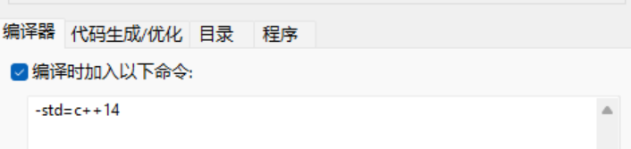
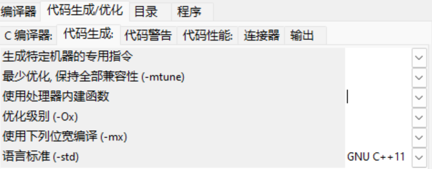
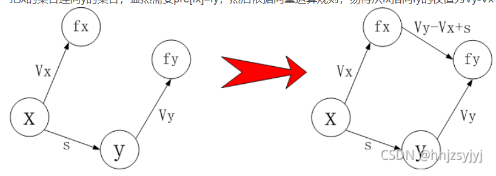

| DEVC++调整可以使用auto           | 对拍函数            | 时间函数           |
| -------------------------------- | ------------------- | ------------------ |
| **随机造数据，里面包含随机造数** | **int128**          | **二分、三分模板** |
| **数论模板**                     | 带权并查集          | **优先队列**       |
| 基本数据结构                     | 树状数组 **线段树** | 字符串哈希         |
| 倍增                             |                     |                    |


调整DEVC++可使用auto
---

* 第一种：工具 $\rightarrow $ 编译选项：
  

* 第二种：编译$\rightarrow$代码生成\优化$\rightarrow$代码生成：
  
  语言标准选择GUN C++ 11.

时间函数
---

> 使用`clock_t start,end; ` 和`start = clock();`
> 使用end - start 结果除以1000就是秒数。

```c++
/*
时间函数！
只需要 clock_t start end;
start = clock(); 最后 end = clock();
end - start  /1000 就是时间。
*/
#include <bits/stdc++.h>
using namespace std;
int main(){

	clock_t start,end;
	start = clock();

	int ans;
	for(int i=1;i<=1000000000;i++){
		int x = i;
		ans+= x*x;
	}
	end = clock();
	cout<<end<<" "<<start<<"\n";
	double time = (double) (end-start) / CLOCKS_PER_SEC;
	cout<<time<<"\n";
	return 0;
}
```

造数据函数
---

> 要点：`srand(time(0))`，之后getrand()函数，明白随机造树的思想。

```c++
#include <bits/stdc++.h>
using namespace std;

const int N = 2e5+5;

int getrand(int x,int y){
	return rand() % (y - x + 1) + x;
}
int fa[N];
int find(int x){
	if(fa[x] == x)return x;
	else return fa[x] = find(fa[x]);
}
int get_tr(){
	int n = 20;
	for(int i=1;i<=n;i++) fa[i] = i;
	int cnt = 0;
	while(cnt<n-1){
		int x = getrand(1,n);
		int y = getrand(1,n);
		int fx = find(x);
		int fy = find(y);
		if(fx == fy) continue;
		cnt++;
		cout<<x<<" "<<y<<"\n";
		fa[fx] = fy;
	} 	
}
signed main()
{
	srand(time(0));
	get_tr();
	return 0;
}
```


\_\_int128的使用
---

> 首先#define i128 \_\_int128.
> 输入用Int 直接赋值，输出的时候可以用下面的print函数，也可以用把i128赋值给longlong 再输出。

```c++
#include <bits/stdc++.h>
using namespace std;

#define i128 __int128
const int N = 2e5+5;

void print(i128 x){
	if(x<0) cout<<"-";
	string t = "";
	
	while(x){
		t += (char) ('0' + x%10);
		x /= 10; 
	}	
	reverse(t.begin(),t.end());
	for(auto v:t) cout<<v;
	cout<<"\n";
}
signed main()
{
	int x = 10;
	i128 now = x;
	for(int i=1;i<15;i++){
		now = now*10;
	}
	long long y = now;
	cout<<y<<"\n";
	return 0;
}
```

二分模板
---

> 就是 l = mid 的时候 int mid = (l+r+1) >> 1;

```c++
#include <bits/stdc++.h>
using namespace std;

const int N = 2e5+5;
signed main()
{
	int l = 1 ;
	int r = 1e9;
	while(l<r){
		int mid = (l+r+1)>>1;
		if(check(mid)) l = mid;
		else r = mid+1;
	}
	return 0;
}
```


三分模板
---

> int lmid = l+(r-l)/3;
> int rmid = r-(r-l)/3;
> 如果 lmid 比较垃圾 l = lmid +1;
> 如果 rmid 比较垃圾 r = rmid -1;
> 如果是小数 没有 +-1. 

**说实话，因为没有遇到过三分，所以其实就算遇到很可能做不出来。**


数论
---

> 快速幂,gcd,组合数公式、初始化，记录因数

```c++
#include <bits/stdc++.h>
using namespace std;
#define int long long 
const int N = 2e5+5;
const int mod = 1e9+7;

int gcd(int a,int b){
    if(b==0) return a;
    else return gcd(b,a%b);
}
int qmi(int a,int b){
	int res = 1;
	while(b){
		if(b&1) res = res * a % mod;
		a = a*a%mod;
		b >>= 1;
	}
	return res;
}
int fa[105];
int inv[105];
void init(){
	fa[1] = 1;
	for(int i=1;i<=100;i++){
		fa[i] = fa[i-1]*i%mod;
	}
	inv[100] = qmi(fa[100],mod-2);
	for(int i=100-1;i>=1;i--){
		inv[i] = inv[i+1] * (i+1) % mod;
	}
}
int C(int x,int y){
	if(x<y) return 0;
	return fa[x]*inv[y]%mod*inv[x-y]%mod;
}

void get_prime_factor(){
	int n = 105;
	vector<int>st(n+5);
	for(int i=2;i<n;i++){
		if(st[i] == 2)continue;
		st[i] = 1;
		for(int j = 2*i;j<n;j+=i){
			st[j] = 2;
		}
	}
	
	vector<int>p;
	int X = 5e5;
	//存储5e5这一个数字的质因数。
	for(int i = 2;i*i<=X;i++){
		if(X%i == 0) {
			p.push_back(i);
			while(X%i == 0) X/=i;
		}
	} 
	if(X>1) p.push_back(X);
}
signed main()
{
	return 0;
}
```

## 优先队列

两种写法；

* 第一种使用node，需要自己定义bool operator <()const{}
* 第二种使用，priority_queue<>q2.里面放pair<int,int>.

```C++
#include <bits/stdc++.h>
using namespace std;

	
struct node{
	int dis;
	bool operator < (node & k )const{
		return dis > k.dis;
	}
};
priority_queue<node>q;
priority_queue<pair<int,int>,vector<pair<int,int>>,greater<pair<int,int>>>q2;
signed main()
{
	return 0;
}
```


## 带权并查集



```c++
#include <bits/stdc++.h>
using namespace std;


const int N = 2e5+6;
int fa[N];
int val[N];
int find(int x){
	if(fa[x] == x) return x;
	int t = fa[x];
	fa[x] = find(fa[x]);
	val[x] += val[t];
}
void merge(int x,int y,int s){
	int fx = find(x);
	int fy = find(y);
	fa[fx] = fy;
	val[fx] = val[y] + s - val[x];
}
signed main()
{
	return 0;
}
```


## 树链剖分

```c++
#include <bits/stdc++.h>
using namespace std;

#define int long long 
const int N = 3e4+5;
int n; 
vector<int>tr[N];
int w[N],cnt;

int dep[N],sz[N],fa[N],son[N];
void dfs1(int x,int F){
	dep[x] = dep[F]+1;
	sz[x] = 1;
	fa[x] = F;
	int max_son = -1;
	for(auto v:tr[x]){
		if(v==F) continue;
		dfs1(v,x);
		sz[x] += sz[v];
		if(sz[v]>max_son) son[x] = v,max_son = sz[v];
	}
}

int top[N],id[N],wt[N];
void dfs2(int x,int topf){
	top[x] = topf;
	id[x] = ++cnt;
	wt[cnt] = w[x];
	if(son[x]) dfs2(son[x],topf);
	for(auto v:tr[x]){
		if(v==fa[x] || v==son[x]) continue;
		dfs2(v,v);
	}
}

int tr1[N<<2],tr2[N<<2];

void build(int k,int l,int r){
	if(l==r){
		tr1[k] = wt[l];
		tr2[k] = wt[l];
		return ;
	} 
	int mid = (l+r)>>1;
	build(2*k,l,mid);
	build(2*k+1,mid+1,r);
	tr1[k] = max(tr1[2*k],tr1[2*k+1]);
	tr2[k] = tr2[2*k] + tr2[2*k+1];
}

int query1(int k,int l,int r,int x,int y){
	if(x<=l && r<=y) return tr1[k];
	int mid = (l+r)>>1;
	int maxa = -1e10;
	if(x<=mid) maxa = max(maxa,query1(2*k,l,mid,x,y));
	if(y>mid) maxa = max(maxa,query1(2*k+1,mid+1,r,x,y));
	return maxa;
}
int query2(int k,int l,int r,int x,int y){
	if(x<=l && r<=y) return tr2[k];
	int mid = (l+r)>>1;
	int ans = 0;
	if(x<=mid) ans+= query2(2*k,l,mid,x,y);
	if(y>mid) ans+= query2(2*k+1,mid+1,r,x,y);
	return ans;
}

void change(int k,int l,int r,int pos,int val){
	if(l==r){
		tr1[k] = tr2[k] = val;
		return ;
	}
	int mid = (l+r)>>1;
	if(pos<=mid) change(2*k,l,mid,pos,val);
	if(pos>mid) change(2*k+1,mid+1,r,pos,val);
	tr1[k] = max(tr1[2*k],tr1[2*k+1]);
	tr2[k] = tr2[2*k] + tr2[2*k+1];
}


int lca(int x,int y){
	while(top[x] != top[y]){
		if(dep[top[x]] < dep[top[y]]) swap(x,y);
		x = top[x];
		x = fa[x];
	}
	if(x==y) return x;
	if(dep[x] > dep[y]) swap(x,y);
	return x;
}

int lca1(int x,int y){
	int maxa = -1e10;
	while(top[x] != top[y]){
		if(dep[top[x]] < dep[top[y]]) swap(x,y);
		maxa = max(maxa,query1(1,1,n,id[top[x]],id[x]));
		x = fa[top[x]];
	}
	if(dep[x] > dep[y]) swap(x,y);
	maxa = max(maxa,query1(1,1,n,id[x],id[y]));
	return maxa;
}
int lca2(int x,int y){
	int ans = 0;
	while(top[x]!= top[y]){
		if(dep[top[x]] < dep[top[y]]) swap(x,y);
		ans += query2(1,1,n,id[top[x]],id[x]);
		x = fa[top[x]];
	}
	if(dep[x]>dep[y]) swap(x,y);
	ans += query2(1,1,n,id[x],id[y]);
	return ans;
}
void solve(){
	cin>>n;
	for(int i=1;i<n;i++){
		int x,y; cin>>x>>y;
		tr[x].push_back(y);
		tr[y].push_back(x);
	}
	for(int i=1;i<=n;i++) cin>>w[i];
	dfs1(1,0);
	dfs2(1,1);

	build(1,1,n);
	int q; cin>>q;
	while(q--){
		string s; cin>>s;
		// cerr<<s<<"\n";
		if(s=="QMAX"){

			int x,y; cin>>x>>y;
			cout<<lca1(x,y)<<"\n";
		}else {
			if(s=="QSUM"){
				int x,y; cin>>x>>y;
				cout<<lca2(x,y)<<"\n";
			} else{
				int x,y; cin>>x>>y;
				change(1,1,n,id[x],y);
			}

		}
	}
}


signed main()
{
	cin.tie(0); ios::sync_with_stdio(false);
	solve();
	return 0;
}
```

